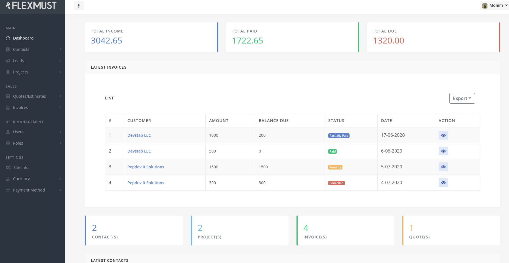

<div align="center">
  <h1>Vue Admin CRM Flexmust</h1>
</div>

<div align="center">
  <strong>Customer Relationship Manager</strong>
</div>

<br>

## Table of Contents

- [What makes Flexmust special?](#what-makes-Flexmust-special)
- [Features](#features)
- [Installation](#installation)
- [Documentation](#documentation)
- [Demo](#demo)
- [Contributing](#contributing)
- [Translations](#translations)
- [Your feedback](#your-feedback)
- [License](#license)

## What makes Flexmust special?

Flexmust is a Responsive Flat Admin CRM and written with Vue and SASS.

## Features

- Responsive layout (desktops, tablets, mobile devices)
- Built with Bootstrap v4.3.1
- Clean and Flat design
- Vue version
- CRM Pages Included
- Contacts
- Leads
- Projects
- Quotes/Estimates
- Invoices
- Users
- Roles
- Site Info
- Currency
- Payment Method

Flexmust is free and always will be.
Help us out… If you love free stuff and great software, give us a star! 🌟


## Learn More

You can learn more in the (https://vuejs.org/v2/guide/).

### Code Splitting

This section has moved here: https://vuejs.org/v2/guide/


## Flexmust

For PWA, single-page storefront go to the (https://github.com/monim143/vue-admin-crm-flexmust) repository.

(https://monim143.github.io/vue-admin-crm-flexmust)

## Dashboard

For dashboard go to the (https://monim143.github.io/vue-admin-crm-flexmust) repository.

(https://github.com/monim143/vue-admin-crm-flexmust)

## Demo

Want to see Flexmust in action?

(https://github.com/monim143/vue-admin-crm-flexmust)

## Contributing

We love your contributions and do our best to provide you with mentorship and support. If you are looking for an issue to tackle, take a look at issues labeled [`Help Wanted`](https://github.com/monim143/vue-admin-crm-flexmust).

If nothing grabs your attention, check [our roadmap](https://github.com/monim143/vue-admin-crm-flexmust) or come up with your feature. Just drop us a line or [open an issue](https://github.com/monim143/vue-admin-crm-flexmust/issues/new) and we’ll work out how to handle it.

Get more details in our [Contributing Guide](https://github.com/monim143).

## Your feedback

Do you use Flexmust as admin platform?
Fill out this short survey and help us grow. It will take just a minute, but mean a lot!

[Take a survey](https://github.com/monim143/vue-admin-crm-flexmust)

## License

Disclaimer: Everything you see here is open and free to use as long as you comply with the [license](https://github.com/monim143/vue-admin-crm-flexmust/blob/master/LICENSE). There are no hidden charges. We promise to do our best to fix bugs and improve the code.

Some situations do call for extra code; we can cover exotic use cases or build you a custom e-commerce appliance.

#### Crafted with ❤️ by (https://github.com/monim143)

ma.monim35@gmail.com


## Project setup
```
npm install
```

### Compiles and hot-reloads for development
```
npm run serve
```

### Compiles and minifies for production
```
npm run build
```

### Run your tests
```
npm run test
```

### Lints and fixes files
```
npm run lint
```

### Install Vue CLI
```
npm i -g @vue/cli
```

### Init Vue CLI UI
```
vue ui
```

### Customize configuration
See [Configuration Reference](https://cli.vuejs.org/config/).
